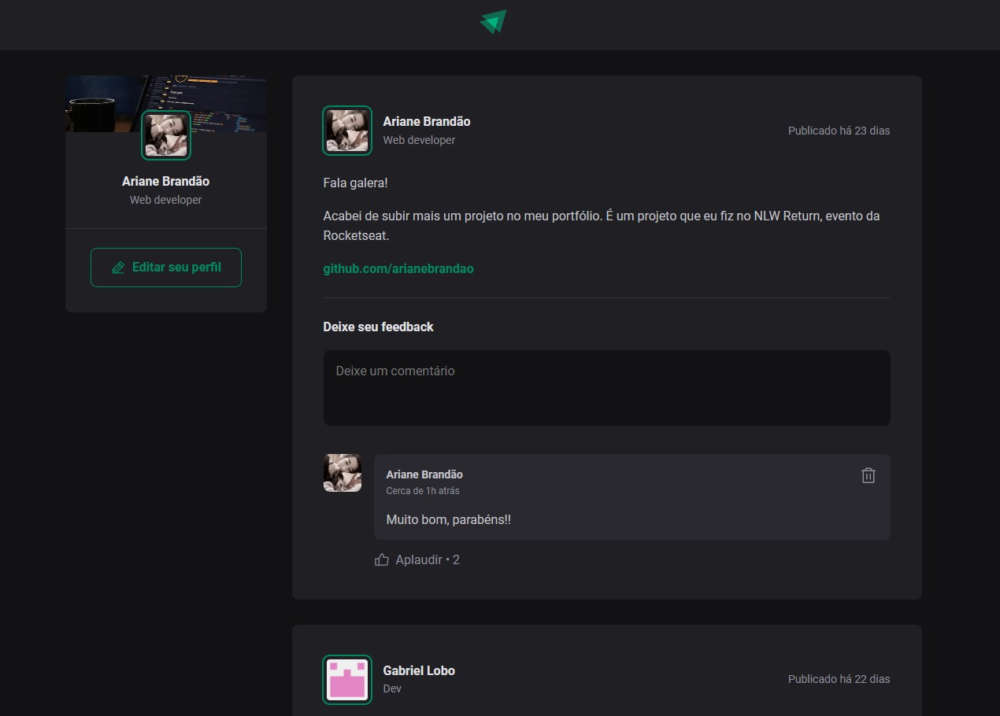

  

## 🚀 Ignite Feed

Ignite Feed é uma interface de rede social, onde é possível adicionar e remover comentários e dar likes nas publicações.

## 💻 Projeto

Essa é uma aplicação React utilizando o Vite e Preact para aprender sobre os conceitos mais importantes do React, entre eles estão componentização, propriedades, estados, imutabilidade e hooks, além de aplicar o TypeScript no projeto para adicionar tipagem estática à aplicação.

## Tecnologias

Esse projeto foi desenvolvido com as seguintes tecnologias:

- [Preact](https://preactjs.com/)
- [TypeScript](https://www.typescriptlang.org/)
- [Vite](https://vitejs.dev)

### Como executar

- Clone o repositório
- Rode a aplicação com `npm run dev`

Agora você pode acessar o link gerado pelo Vite no navegador.